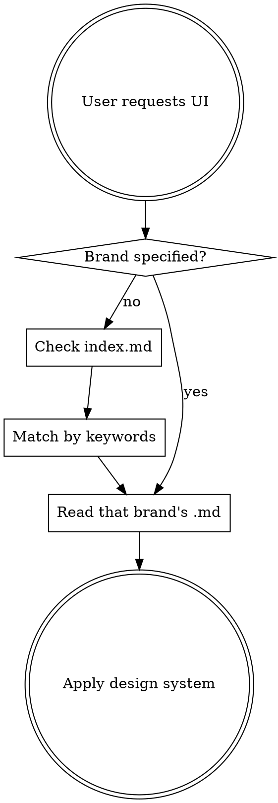

# Design.md Styles

55 curated DESIGN.md design systems from real websites. Each defines a complete visual language: colors, typography, components, layout, elevation.

## How to Use

**NEVER load all styles at once.** Always follow this flow:

1. If user names a brand (e.g., "make it look like Stripe") → read `styles/<brand>.md` directly
2. If user describes a style → scan `index.md` for best match, then read that brand's `.md`
3. Apply the design system to generate UI

## Quick Brand Reference

| Category | Brands |
|----------|--------|
| AI / ML | claude, cohere, elevenlabs, minimax, mistral.ai, ollama, opencode.ai, replicate, runwayml, together.ai, voltagent, x.ai |
| Dev Tools | cursor, expo, linear.app, lovable, mintlify, posthog, raycast, resend, sentry, supabase, superhuman, vercel, warp, zapier |
| Infra / Cloud | clickhouse, composio, hashicorp, mongodb, sanity, stripe |
| Design / Productivity | airtable, cal, clay, figma, framer, intercom, miro, notion, pinterest, webflow |
| Fintech / Crypto | coinbase, kraken, revolut, wise |
| Enterprise / Consumer | airbnb, apple, bmw, ibm, nvidia, spacex, spotify, uber |

## File Location

All style files are at: `styles/<brand-name>.md` relative to this skill directory.

## What Each DESIGN.md Contains

Every file follows the same 9-section structure:
1. Visual Theme & Atmosphere
2. Color Palette & Roles (semantic names + hex values)
3. Typography Rules (font families, hierarchy table)
4. Component Stylings (buttons, cards, inputs, navigation)
5. Layout Principles (spacing, grid, whitespace)
6. Depth & Elevation (shadow system)
7. Do's and Don'ts
8. Responsive Behavior
9. Agent Prompt Guide (ready-to-use prompts)

## Usage with Google Stitch

These DESIGN.md files are compatible with [Google Stitch's DESIGN.md format](https://stitch.withgoogle.com/docs/design-md/overview/). You can also copy them directly into project roots for Stitch or any AI coding agent.
