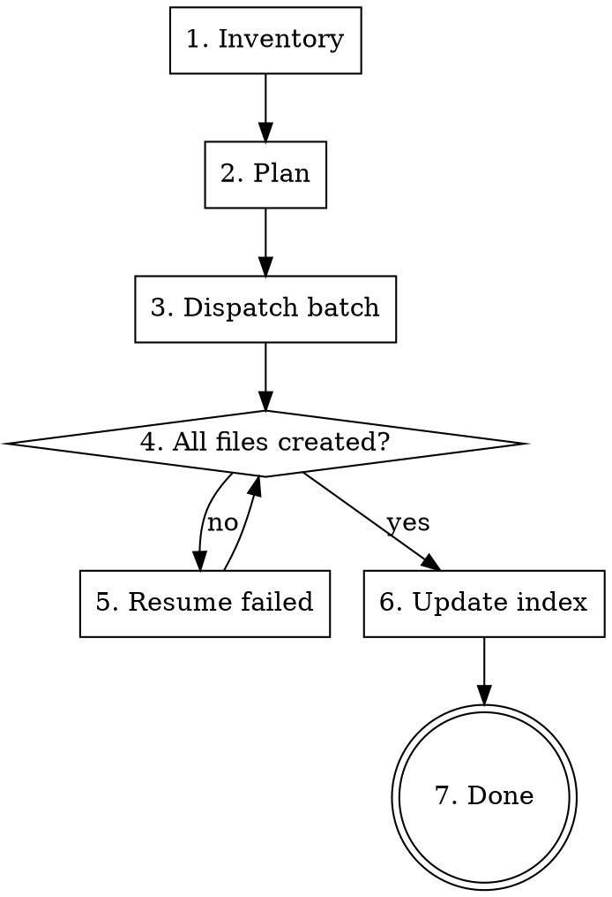

# Papers to Blog: Research PDFs → Categorized Article Series

## Overview

Convert a directory of research PDFs into a planned, structured series of educational articles using parallel subagent dispatch. Each article cites 3-8 core papers from the collection.

**Core principle:** Read → Classify → Plan → Dispatch in batches → Verify → Resume failures → Build index.

## When to Use

- Directory of research PDFs → readable article series
- Literature collection → health education / blog posts
- Conference proceedings → categorized summaries

**Not for:** Single paper summaries, non-research content, creative writing.

## Workflow



## Phase 1: Inventory & Plan

1. **Glob** all PDFs in target directory. Count them.
2. Read existing plan file if present (e.g., `implementation.md`, `README.md`).
3. Define article topics. Each article needs 3-8 core papers.
4. Assign PDFs to topics (rough — agents re-scan for relevance).
5. Define standard article structure (see template below).

**Output:** TodoWrite with article list, batch assignments, index page task.

## Phase 2: Dispatch (4 agents per batch)

Each agent gets a **self-contained prompt** containing:

| Section | What to include |
|---------|----------------|
| Topic | Specific article title and focus |
| PDF list | Full paths of assigned PDFs (agent re-scans for relevance) |
| Article structure | Exact section headings with brief descriptions |
| Reader profile | Target audience, tone, language |
| Writing rules | AI pattern removal, word count, naming conventions |
| Save path | Exact output file path |
| Report format | What to return: PDFs read, core papers selected, word count, unverified citations |

**Critical:** Each prompt must be fully self-contained. Agents don't share context.

## Phase 3: Verify & Recover

After agents return, **always verify files were created** (glob the output pattern).

### Known Failure: Agent reads PDFs but doesn't write

This is the #1 failure mode. Agents consume context reading PDFs and run out before writing.

**Recovery:** Resume the agent's task_id with a simplified prompt:
```
You already read the PDFs and found core papers. Now:
1. Write the article [topic] using your earlier research
2. Follow structure: [headings list]
3. Save to: [path]
```

**Prevention:** Give agents explicit instruction to prioritize writing over exhaustive reading. "Read first 200 lines of each PDF, select 3-8 relevant, then WRITE."

## Phase 4: Index Page

After all articles exist:
1. Read each article's YAML frontmatter (first 10 lines)
2. Write/update `index.md` with: series description, linked article list, reading guide, disclaimer, help hotlines (if health content)

## Article Structure Template

```yaml
---
title: "[Article Title]"
description: "[120-155 chars: topic + key concepts]"
keywords: ["keyword1", "keyword2"]
tags: ["tag1", "tag2"]
date: "YYYY-MM-DD"
---
```

```markdown
# [Title]

## 先說結論
## 為什麼這個主題重要？
## [Topic-specific sections — 3-5 sections]
## 對案主/讀者有什麼意義？
## 不能過度解讀的地方
## 什麼情況應該尋求專業協助？
## 常見問題 FAQ (3-5 items)
## 參考文獻
```

**Reference format:** Author (Year). Title. Journal, DOI. Unverifiable → `[NEEDS VERIFICATION]`.

## Writing Rules (include in every agent prompt)

- Target audience: general public / patients (not professionals unless specified)
- Call patients "案主" (or specified term)
- Avoid AI patterns: no 此外/至關重要/凸顯/標誌著, no 不僅…而且, no three-item lists, no "未來可望…"
- Vary sentence length. Use specific numbers over vague descriptions.
- Tone: like a caring professional talking to a friend, not a textbook
- 3000-5000 words per article
- Save as NEW file, never overwrite source PDFs

## Common Mistakes

| Mistake | Fix |
|---------|-----|
| Dispatching all agents with identical prompts | Each prompt needs unique topic + PDF assignment |
| Agent prompt lacks save path | Always include exact output file path |
| Not verifying file creation after dispatch | Glob output pattern immediately after agents return |
| Giving agents too many PDFs (20+) | Assign 10-15 per agent; they select 3-8 relevant |
| Forgetting index page | Add as final todo item |
| Skipping resume for failed agents | Resume with simplified "just write" prompt using same task_id |
| Agents writing in parallel edit same file | Each agent gets unique output filename |

## Real-World Impact

Applied to 49 NIRS depression research PDFs → 10 articles + 1 index page in 3 batches:
- Batch 1 (4 agents): 1/4 completed, resumed 3 → all done
- Batch 2 (4 agents): 0/4 completed, resumed 4 → all done
- Batch 3 (2 agents): 2/2 completed
- Total: ~41,000 words, 40+ paper citations, 5 [NEEDS VERIFICATION] marks

**Key lesson:** Expect 50-75% first-dispatch failure rate. Always plan for resume.
